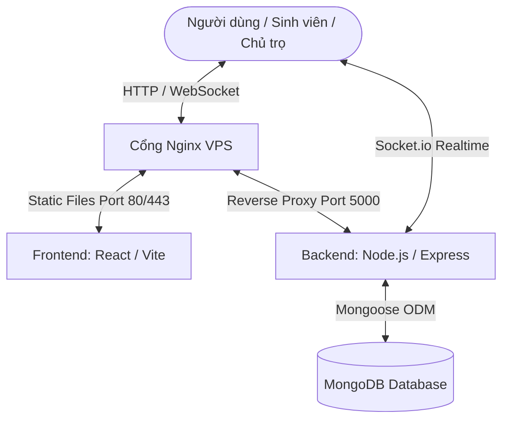

# 🏠 PhongTroVL — Hệ thống Tìm kiếm & Quản lý Phòng trọ Sinh viên Vĩnh Long

> **Đề tài Khóa luận Tốt nghiệp** — Xây dựng hệ thống hỗ trợ tìm kiếm và gợi ý phòng trọ sinh viên trên địa bàn Tỉnh Vĩnh Long theo hướng kết hợp

---

## 📌 1. Mục tiêu dự án

Dự án được xây dựng nhằm giải quyết các khó khăn trong việc tìm kiếm nhà trọ của sinh viên tại khu vực tỉnh Vĩnh Long, đồng thời hỗ trợ chủ trọ quản lý tin đăng và kết nối trực tiếp với người thuê trọ. Các mục tiêu cụ thể bao gồm:
* **Hỗ trợ sinh viên**: Tìm kiếm phòng trọ trực quan trên bản đồ số, lọc chi tiết theo nhu cầu (giá cả, diện tích, tiện ích, vị trí hiện tại), so sánh phòng trọ, trao đổi trực tiếp và hẹn lịch xem phòng với chủ trọ.
* **Hỗ trợ chủ trọ**: Đăng tải thông tin phòng trọ với vị trí tọa độ GPS chính xác, quản lý trạng thái phòng trọ (còn trống, đã thuê), quản lý lịch hẹn xem phòng và chăm sóc khách hàng qua chat thời gian thực.
* **Hỗ trợ quản trị viên**: Kiểm duyệt chất lượng tin đăng, quản lý người dùng, duyệt đánh giá, và xử lý các báo cáo vi phạm để duy trì tính minh bạch của hệ thống.

---

## 🏗️ 2. Kiến trúc hệ thống & Công nghệ sử dụng

Hệ thống được thiết kế theo mô hình Client - Server tách biệt, giao tiếp qua **RESTful API** và kết nối thời gian thực qua **WebSockets (Socket.io)**.



### 🛠️ Công nghệ cốt lõi

| Thành phần | Công nghệ / Thư viện chính | Port mặc định |
|---|---|---|
| **Frontend** | React 18, Vite, Tailwind CSS, Leaflet Maps, React-Redux, Socket.io-client | `5173` |
| **Backend** | Node.js, Express, Mongoose (MongoDB Atlas), Socket.io, Nodemailer, Cloudinary | `5000` |
| **Database** | MongoDB Atlas / Local MongoDB | `27017` |

---

## 📂 3. Cấu trúc thư mục dự án

```text
📁 1doankhoaluantotnghiep/
├── 📁 docs/                   # Tài liệu thiết kế, đề cương chi tiết khóa luận
├── 📁 src/
│   ├── 📁 frontend/           # Mã nguồn Client (React + Vite)
│   └── 📁 backend/            # Mã nguồn API Server (Node.js + Express)
├── 📄 .gitignore              # Cấu hình bỏ qua tệp tin Git
└── 📄 README.md               # Tài liệu giới thiệu và hướng dẫn triển khai dự án
```

---

## 👥 4. Các tính năng cốt lõi theo tác nhân

### 1️⃣ Sinh viên (Người thuê trọ)
* **Tài khoản**: Đăng ký, đăng nhập (JWT), xác thực email đăng ký, quên mật khẩu, cập nhật hồ sơ cá nhân.
* **Tìm kiếm & Bộ lọc**: Tìm kiếm theo từ khóa, lọc theo mức giá (min/max), diện tích, tiện ích (wifi, máy giặt, điều hòa...), khu vực hành chính (quận/huyện, phường/xã), lọc theo bán kính khoảng cách từ vị trí GPS hiện tại.
* **Bản đồ số**: Hiển thị kết quả tìm kiếm trực quan trên bản đồ Leaflet, hiển thị khoảng cách và đường đi từ vị trí hiện tại đến phòng trọ.
* **Đặt lịch hẹn**: Chọn ngày, khu vực sáng/chiều/tối để hẹn gặp chủ trọ trực tiếp xem phòng.
* **Chat Realtime**: Chat trực tuyến trực tiếp với chủ trọ tích hợp trạng thái hoạt động (online/offline, typing...).
* **Tương tác**: Lưu phòng yêu thích, so sánh đối chiếu giữa 3 phòng trọ khác nhau, gửi đánh giá (rating & bình luận) và gửi báo cáo vi phạm nếu tin đăng ảo/lừa đảo.

### 2️⃣ Chủ trọ (Landlord)
* **Quản lý phòng**: Đăng tin phòng trọ mới kèm ghim vị trí chính xác trên bản đồ, mô tả, tiện ích, tải ảnh lên Cloudinary. Cập nhật thông tin phòng hoặc đổi trạng thái nhanh (Đang trống / Đã cho thuê).
* **Quản lý lịch hẹn**: Tiếp nhận và phê duyệt/từ chối lịch hẹn xem phòng từ sinh viên kèm thông báo realtime.
* **Chăm sóc khách hàng**: Trả lời tin nhắn thắc mắc của sinh viên qua kênh chat trực tuyến.

### 3️⃣ Quản trị viên (Admin)
* **Duyệt tin**: Duyệt hoặc từ chối các tin đăng phòng trọ mới từ chủ trọ trước khi hiển thị công khai.
* **Quản lý người dùng**: Xem danh sách, lọc và khóa/mở khóa tài khoản người dùng vi phạm quy chế.
* **Quản lý đánh giá**: Kiểm duyệt các đánh giá của sinh viên để tránh spam/ngôn từ không phù hợp.
* **Xử lý báo cáo**: Tiếp nhận báo cáo vi phạm từ người dùng và quyết định gỡ bỏ phòng trọ vi phạm hoặc khóa chủ trọ.
* **Thống kê**: Xem tổng quan số lượng phòng, người dùng, chủ trọ, biểu đồ tăng trưởng số phòng theo tháng.

---

## 🚀 5. Hướng dẫn chạy dự án dưới máy Local (Development)

### Yêu cầu hệ thống
* **Node.js**: Phiên bản 18.x trở lên
* **npm**: Phiên bản 9.x trở lên
* **MongoDB**: Tài khoản MongoDB Atlas (khuyên dùng) hoặc MongoDB Local cài trên máy.

### 🔌 Cấu hình Biến môi trường (`.env`)

#### Cấu hình Backend (`src/backend/.env`)
Tạo file `.env` tại thư mục `src/backend/` dựa trên file `.env.example`:
```env
PORT=5000
MONGODB_URI=mongodb+srv://<username>:<password>@cluster0.mongodb.net/phongtro?retryWrites=true&w=majority
JWT_SECRET=ma_khoa_bao_mat_jwt_cua_ban
JWT_EXPIRES_IN=7d
CLOUDINARY_CLOUD_NAME=ten_cloud_cua_ban
CLOUDINARY_API_KEY=api_key_cua_ban
CLOUDINARY_API_SECRET=api_secret_cua_ban
EMAIL_USER=email_gui_otp@gmail.com
EMAIL_PASS=mat_khau_ung_dung_gmail
FRONTEND_URL=http://localhost:5173
```

#### Cấu hình Frontend (`src/frontend/.env`)
Tạo file `.env` tại thư mục `src/frontend/`:
```env
VITE_API_URL=http://localhost:5000
VITE_GOOGLE_CLIENT_ID=google_client_id_cua_ban_neu_co
```

---

### ⚙️ Các bước khởi chạy dự án

#### Bước 1: Chạy Backend API
1. Di chuyển vào thư mục backend:
   ```bash
   cd src/backend
   ```
2. Cài đặt các thư viện:
   ```bash
   npm install
   ```
3. Khởi tạo dữ liệu mẫu (Seeding Database) - chỉ cần chạy lần đầu tiên:
   ```bash
   node seed.js
   ```
4. Khởi chạy server ở chế độ phát triển:
   ```bash
   npm run dev
   ```
   > API Server sẽ khởi động tại địa chỉ: `http://localhost:5000`

#### Bước 2: Chạy Frontend Client
1. Mở một terminal mới và di chuyển vào thư mục frontend:
   ```bash
   cd src/frontend
   ```
2. Cài đặt các thư viện:
   ```bash
   npm install
   ```
3. Khởi chạy ứng dụng:
   ```bash
   npm run dev
   ```
   > Giao diện người dùng sẽ chạy tại địa chỉ: `http://localhost:5173`

---

## 🌐 6. Hướng dẫn triển khai chi tiết trên VPS Linux (Ubuntu - Không dùng Docker)

Hướng dẫn này áp dụng cho hệ điều hành **Ubuntu Server 20.04/22.04 LTS**. Chúng ta sẽ sử dụng **PM2** để chạy ngầm Backend Node.js và **Nginx** để phục vụ ứng dụng Frontend React tĩnh kết hợp Reverse Proxy định tuyến API và cấu hình HTTPS bảo mật.

### 📌 Bước 1: Cài đặt các gói phần mềm cần thiết trên VPS
Kết nối SSH vào VPS của bạn và chạy các lệnh sau:
```bash
# Cập nhật danh sách gói phần mềm
sudo apt update && sudo apt upgrade -y

# Cài đặt Git và Nginx
sudo apt install git nginx curl -y

# Cài đặt Node.js LTS (sử dụng NodeSource)
curl -fsSL https://deb.nodesource.com/setup_18.x | sudo -E bash -
sudo apt install -y nodejs

# Cài đặt PM2 toàn cục (Global)
sudo npm install pm2 -g
```

### 📌 Bước 2: Tải mã nguồn dự án lên VPS
1. Di chuyển vào thư mục `/var/www/`:
   ```bash
   cd /var/www
   ```
2. Clone repository của bạn từ GitHub (hoặc tải mã nguồn lên qua SFTP):
   ```bash
   git clone <URL_REPOSITORY_CUA_BAN> phongtro-vinhlong
   cd phongtro-vinhlong
   ```

### 📌 Bước 3: Cấu hình và chạy Backend API bằng PM2
1. Di chuyển vào thư mục Backend:
   ```bash
   cd src/backend
   ```
2. Cài đặt các gói phụ thuộc (dependencies):
   ```bash
   npm install --production
   ```
3. Tạo file cấu hình môi trường `.env` chạy thật:
   ```bash
   nano .env
   ```
   *Điền đầy đủ thông tin kết nối cơ sở dữ liệu MongoDB Atlas thực tế, API Cloudinary, Email và sửa `FRONTEND_URL` thành domain thực tế của bạn (ví dụ: `https://phongtrovl.com`). Sửa `NODE_ENV=production`.*

4. Chạy Backend bằng PM2 để đảm bảo máy chủ luôn chạy ngầm và tự khởi động lại khi hệ thống khởi động lại (Reboot):
   ```bash
   pm2 start index.js --name "phongtro-backend"
   
   # Cấu hình tự khởi động PM2 cùng hệ thống VPS
   pm2 startup
   pm2 save
   ```
   *Ghi chú: Để kiểm tra trạng thái hoạt động hoặc log lỗi của Backend, dùng lệnh `pm2 status` hoặc `pm2 logs`.*

### 📌 Bước 4: Build Frontend React/Vite
1. Di chuyển vào thư mục Frontend:
   ```bash
   cd /var/www/phongtro-vinhlong/src/frontend
   ```
2. Cài đặt dependencies:
   ```bash
   npm install
   ```
3. Tạo file `.env` cấu hình đường dẫn API thực tế:
   ```bash
   nano .env
   ```
   *Nhập URL Backend thực tế của bạn (sử dụng giao thức HTTPS), ví dụ:*
   ```env
   VITE_API_URL=https://api.phongtrovl.com
   ```
4. Biên dịch mã nguồn React sang dạng tệp tĩnh tối ưu (Production Build):
   ```bash
   npm run build
   ```
   *Sau khi build xong, thư mục `/var/www/phongtro-vinhlong/src/frontend/dist` chứa toàn bộ mã nguồn HTML/JS/CSS sẵn sàng để serve.*

### 📌 Bước 5: Cấu hình Nginx làm Web Server và Reverse Proxy
Chúng ta sẽ cấu hình Nginx để serve các file tĩnh của Frontend tại thư mục `dist` và đồng thời chuyển tiếp (Reverse Proxy) các yêu cầu API, WebSocket (Socket.io) đến cổng `5000` của Backend.

1. Tạo file cấu hình site mới cho dự án trong Nginx:
   ```bash
   sudo nano /etc/nginx/sites-available/phongtro
   ```
2. Sao chép nội dung cấu hình dưới đây và thay đổi các domain `phongtrovl.com` và `api.phongtrovl.com` bằng tên miền thực tế của bạn:
   ```nginx
   # 1. Cấu hình Serve Frontend
   server {
       listen 80;
       server_name phongtrovl.com www.phongtrovl.com;

       root /var/www/phongtro-vinhlong/src/frontend/dist;
       index index.html;

       location / {
           try_files $uri $uri/ /index.html;
       }

       # Cấu hình cache cho các file static assets
       location ~* \.(?:css|js|jpg|jpeg|gif|png|ico|cur|gz|svg|svgz|mp4|ogg|ogv|webm|htc)$ {
           expires 1M;
           access_log off;
           add_header Cache-Control "public";
       }
   }

   # 2. Cấu hình Reverse Proxy Backend & Socket.io
   server {
       listen 80;
       server_name api.phongtrovl.com;

       location / {
           proxy_pass http://localhost:5000;
           proxy_http_version 1.1;
           
           # Các headers quan trọng để hỗ trợ WebSocket cho Socket.io
           proxy_set_header Upgrade $http_upgrade;
           proxy_set_header Connection "upgrade";
           proxy_set_header Host $host;
           proxy_set_header X-Real-IP $remote_addr;
           proxy_set_header X-Forwarded-For $proxy_add_x_forwarded_for;
           proxy_set_header X-Forwarded-Proto $scheme;
       }
   }
   ```
3. Lưu file cấu hình và kích hoạt cấu hình này bằng cách tạo liên kết (symlink):
   ```bash
   sudo ln -s /etc/nginx/sites-available/phongtro /etc/nginx/sites-enabled/
   ```
4. Kiểm tra xem cấu hình Nginx có lỗi cú pháp không:
   ```bash
   sudo nginx -t
   ```
5. Nếu không có lỗi, tải lại cấu hình Nginx để áp dụng:
   ```bash
   sudo systemctl restart nginx
   ```

### 📌 Bước 6: Cấu hình SSL miễn phí với Let's Encrypt (HTTPS)
Để bảo mật truyền tải dữ liệu và cho phép các tính năng như lấy tọa độ GPS vị trí hiện tại (GPS yêu cầu HTTPS trên các trình duyệt hiện đại), chúng ta cần cài đặt chứng chỉ SSL.

1. Cài đặt Certbot và plugin Nginx:
   ```bash
   sudo apt install certbot python3-certbot-nginx -y
   ```
2. Yêu cầu chứng chỉ SSL và tự động cấu hình Nginx:
   ```bash
   sudo certbot --nginx -d phongtrovl.com -d www.phongtrovl.com -d api.phongtrovl.com
   ```
3. Làm theo hướng dẫn trên màn hình (nhập email, đồng ý điều khoản dịch vụ). Certbot sẽ tự động chỉnh sửa file cấu hình Nginx để tích hợp SSL và tự động thiết lập chuyển hướng HTTP sang HTTPS.
4. Kiểm tra tính năng tự động gia hạn SSL:
   ```bash
   sudo certbot renew --dry-run
   ```

---

## 🔒 7. Bảo mật & Tối ưu hóa trên Production

* **Phân quyền MongoDB**: Đảm bảo user database của bạn chỉ có quyền đọc/ghi trên database `phongtro_vl`, không dùng tài khoản root admin của Cluster.
* **CORS Policy**: Trong file `.env` của backend, thiết lập biến `FRONTEND_URL` chính xác là domain frontend của bạn để chặn các truy cập API trái phép từ các domain khác.
* **Giới hạn dung lượng upload**: Nginx mặc định giới hạn file upload là 1MB. Cần cấu hình thêm `client_max_body_size 10M;` trong block `http` hoặc `server` của Nginx nếu chủ trọ muốn đăng tải ảnh phòng trọ dung lượng lớn.
* **PM2 Autostart**: Luôn chạy `pm2 save` sau mỗi lần khởi chạy dịch vụ mới để lưu cấu hình trạng thái của các tiến trình Node.js.
